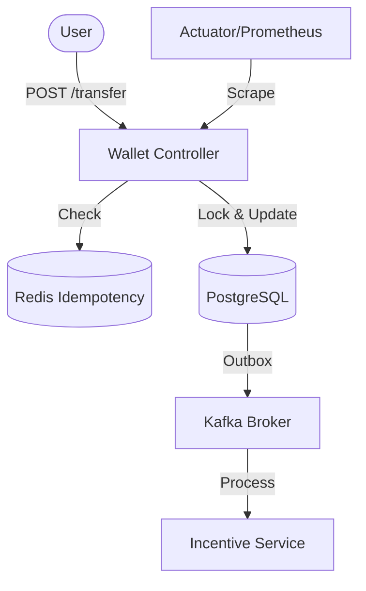

# Astra-Pay Monorepo

Welcome to the Astra-Pay project. This repository is structured as a monorepo containing both the backend and frontend.

A high-performance, event-driven financial ledger and P2P payment system designed for extreme scale, concurrency, and reliability.

## 🚀 Overview
Astra-Pay is engineered to demonstrate architectural excellence in the fintech space. It focuses on solving common digital payment challenges such as synchronous bottlenecks, double-spending, and monolithic constraints.

## 🛠️ Tech Stack
- **Framework:** Spring Boot 3.3 (Java 21) & React + Tailwind CSS (Vite)
- **Runtime:** JVM with Virtual Threads (Project Loom) enabled
- **Database:** PostgreSQL (ACID compliant)
- **Caching & Locks:** Redis (Distributed locking & Idempotency)
- **Event Streaming:** Apache Kafka (Asynchronous decoupling)
- **Security:** Spring Security + JWT
- **Build Tool:** Maven & npm

## ✨ Core Features
- **Wallet Management:** Secure account provisioning and isolated balance records.
- **P2P Transaction Engine:** Asynchronous transfers via Kafka event streams.
- **Incentive Engine:** Decoupled service for rewards and cashbacks.
- **Event Sourced Ledger:** Persistent, immutable log of all operations.
- **Pessimistic Locking Strategy:** Prevents race conditions during simultaneous fund transfers using PostgreSQL row-level locks.

## 🏗️ Architecture & System Design

Astra-Pay is built on a high-concurrency, event-driven architecture designed for financial integrity.

### Workflow: Funds Transfer
1. **API Gateway / Filter Layer**: Intercepts requests for basic validation (positive amounts, non-null recipients).
2. **Idempotency Guard**: Checks Redis for the `X-Idempotency-Key` to prevent double-spending.
3. **Ledger Service (WalletService)**: 
    - Acquires **Pessimistic Write Locks** on sender and recipient accounts in a sorted order to prevent deadlocks.
    - Validates funds and updates balances within a single database transaction.
4. **Transactional Outbox**: Saves the transaction event to the database and later publishes to Kafka.
5. **Observability**: Prometheus scrapes the `/actuator/prometheus` endpoint for latency and Kafka lag metrics.



## 📈 Reliability & Observability

### Concurrency Strategy
Astra-Pay uses **Pessimistic Locking** (`PESSIMISTIC_WRITE`) at the database row level. This ensures that even under extreme concurrency (e.g., thousands of people sending money to one influencer simultaneously), the balance remains consistent and no race conditions occur.

### Integration Testing
We use **Testcontainers** to spin up ephemeral PostgreSQL and Kafka instances during the build process. This ensures that our integration tests run in a production-like environment.
- `WalletServiceIntegrationTest`: Verifies concurrent transfers using `ExecutorService` and `CountDownLatch`.

### Metrics & Monitoring
The system exports real-time metrics via Micrometer and Spring Boot Actuator:
- **Endpoint**: `/actuator/prometheus`
- **Key Metrics**:
    - `http_server_requests_seconds_sum`: API latency histograms.
    - `kafka_consumer_lag`: Real-time monitoring of event processing delay.
    - `jvm_threads_live_threads`: Monitoring Virtual Thread performance.

## 🚀 Getting Started

### 1. Prerequisites
Ensure you have the following installed and running:
- **Java 21**: Microsoft OpenJDK 21 or equivalent.
- **Docker Desktop**: To run backing services.
- **PostgreSQL**: `localhost:5432/astrapay` (via Docker)
- **Redis**: `localhost:6379` (via Docker)
- **Kafka**: `localhost:9092` (via Docker)
- **Node.js**: v18+ for frontend.

### 2. Infrastructure Setup
Start the backing services using Docker Compose:
```bash
docker-compose up -d
```
This will pull and start Postgres, Redis, and Kafka in the background.

### 3. Backend (Spring Boot)
The backend handles authentication, wallet management, and transaction ledger.
```bash
cd backend
mvn clean install
mvn spring-boot:run
```
*Port: 8080*

### 4. Frontend (React + Vite)
The frontend provides a dashboard UI for users to manage their wallets.
```bash
cd frontend
npm install
npm run dev
```
*Port: 5173 (default Vite port)*

## 🔒 Security
- JWT-based stateless authentication.
- Hibernate Validator for stringent payload checks.
- Redis-based distributed locks for concurrent critical sections.

## 🌟 Key Highlights
- **Atomic Transfers**: Guaranteed state consistency using Spring Data JPA and Postgres ACID transactions.
- **Race Condition Immunity**: Implements row-level Pessimistic Locking on all wallet operations.
- **Idempotency Shield**: Custom Redis-backed middleware ensuring no transaction is processed twice.
- **Loom Powered**: Utilizes Virtual Threads to handle thousands of concurrent payment requests with minimal overhead.

## 📂 Project Structure
- `backend/`: Java Spring Boot application.
- `frontend/`: React + Tailwind CSS dashboard.
- `docs/`: Design system, todo lists, and other documentation.
